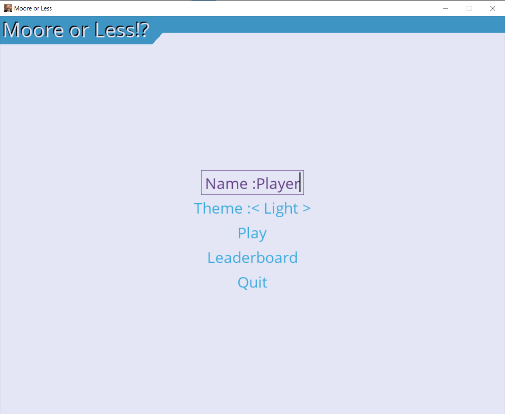
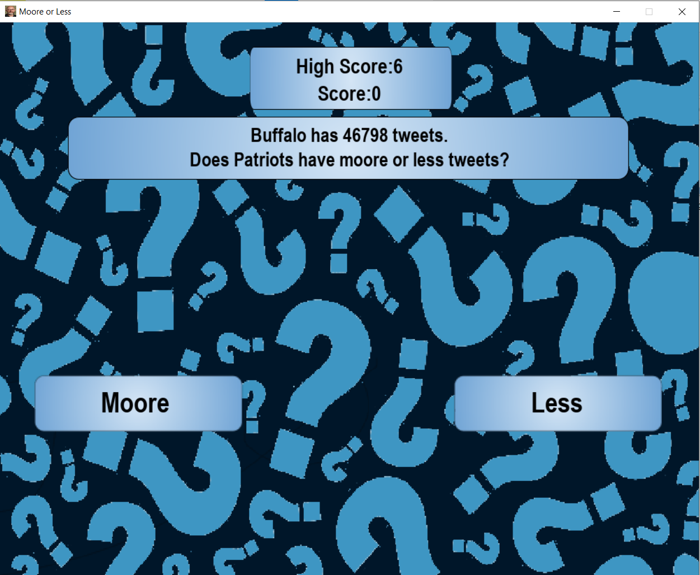
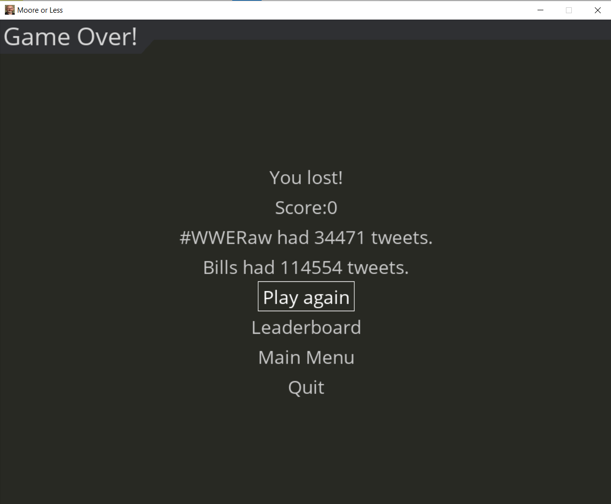

# CS110 Project Proposal
# Moore or Less
## CS 110 Final Project
### Fall, 2021
### [Assignment Description](https://docs.google.com/document/d/1H4R6yLL7som1lglyXWZ04RvTp_RvRFCCBn6sqv-82ps/edit#)

https://github.com/bucs110a0fall21/final-project-moore-or-less

https://docs.google.com/presentation/d/1RFF7jtQ8mmYTO2pxIF82ZRfg1pzqKFCi5o5XCRPRL84/edit?usp=sharing

### Team: Moore or less
#### Senih Okuyucu, Sharan Saha, Clayton Battle

***

## Project Description 
Our project is a trend guessing game, where a random trend from twitter is shown. The trends are pulled from twitter using Tweepy, a python based twitter API library. Trends pulled from twitter are then put into a shuffled deck, from which one trend is chosen. This trend, called the Base Trend (BT), is shown along with the number of tweets associated with it, which is then compared to another random trend, called the Comparison Trend(CT). The user has to guess whether or not the CT has more or less tweets than the BT. Upon a successful guess, a point is added to the user's score, and if the player has passed the high score for their corresponding name, the high score is updated as well. The objective of the game is to obtain the highest score possible. The game ends when the user makes an incorrect guess on what trend has more tweets. Upon losing, the user is presnted with their score, and the number of tweets the CT and BT had. The user's score is then updated to the leaderboard. 

We will start off working with pygame and once we have work that fulfills the requirements of the project we will incorporate our work into a website and ideally an app. 

***    

## User Interface Design 
* Initial GUI concepts
	* 
	* 
	* 
	* 
	
* Final GUI 
	* 
	* 
	* 
	* 
	* 
	* 
	* 
	* 

	* Main Menu:Presents our game's title, along with buttons allowing the user to start the game, view a leaderboard, or access settings. In the final version, the settings button is replaced with a simple light/dark mode switch, as it's the only user setting.
	* Selection:Users are presented with two tweets, and must chose which has more tweets. They may click either option, or access settings. Orininally the options would have photos, but some trending twitter topics are controversial so this idea was scrapped.
	* Game Over:Users are shown tweet counts for both trends, and have the options to play again, view the leaderboard, or access settings.
	* Leaderboard:Users are presented a list of up to ten other players with their highest scores to see where they rank in comparison to others. If there are less than ten players in the user info, then there are filler posistions displayed where the player name is "Player" and the Score is N/A.
	* Settings:Users have the ability to make the game full screen, or change other game settings. This menu was later scrapped and integrated with the main menu.

***        

## Program Design 
* Non-Standard libraries
    * pygame 
        * https://www.pygame.org/ 
        * Module incorporating many common game development functions into python. Handles all the graphical elements in our code.
    * Tweepy 
        * https://www.tweepy.org/
        * Easy to use python library for accessing the Twitter API. Returns raw data for real time trending topics in the Twitter app. 
    * Pygame Menus
        * https://pypi.org/project/pygame-menu/
        * Library for creating menus and GUIS. Gives people the ability to easily add visuals and menus to their code. 
        
* Class Interface Design
    * 

* Classes
    * apiCall - Handles getting all the raw API data from the Twitter API and filters the data that can be worked with and adds it to trends.json 
    * apiCodes - Holds our api keys, twitter access tokens, and returns them when assignValues is called.
    * button - Updates the screen and label when it is clicked. 
    * label - Displays the base and comparison trends and trends update when a button is clicked on screen. 
    * Controller 
        * Responds to every event in the GUI, runs our menus, calls apiCall when the game starts, and takes the data from trends.json 
        * Handles all the logic of base and comparison trends and makes sure they are appropriately displayed in the buttons/labels
        * When a new user is added or if a new high score for an existing user is achieved, userinfo.json is updated with that information 

## Project Structure 

The Project is broken down into the following file structure:
* main.py
* src
    * apiCall.py
    * apiCodes.py
    * button.py
    * Codes.Zip
    * trends.txt
    * ProjectVenv
    * controller.py
    * label.py
    * trends.json
    * userinfo.json
* assets
    * MainMenu.jpg
    * Settings.jpg
    * general_structure.jpg
    * Selection.jpg
    * GameOver.jpg
    * Button.png
    * samoore.jpg
    * Label.png
    * SmallLabel.png
    * Dark_Background.png
    * DarkLeaderboardFinal.png
    * DarkGameOverFinal.png
    * DarkMainMenuFinal.png
    * DarkSelectionFinal.png
    * Light_Background.png
    * LightGameOverFinal.png
    * LightLeaderboardFinal.png
    * LightMainMenuFinal.png
    * LightSelectionFinal.png
    

***

## Tasks and Responsibilities 

### Software Lead - Senih O

Senih spent a lot of the early stages of the project researching and attmepting to get a working twitter API. This was accomplished by extensive research on the Tweepy Library and it's interaction with twitters API. Once that was done, most of his work was primarily focused on overseeing the vision and execution of the program's mechanics and GUI, along with integrating the back-end classes and data with the GUI on the front end.

### Front End Specialist - Clay B

Clay lead conducted significant research on making GUIs in pygame and the pygame-menus library. We wanted to ensure the menus we created were high quality and functional, so Clay researched a libarary to help us with this. In addition, Clay wrote the GUI portions of our controller class, coded our menus, and was responsible for placing our models on screen.

### Back End Specialist - Sharan S

Sharan was responsible for taking raw data from API and formatting it to work with rest of program. The base trends and comparison trends are random items from the list in trends.json, and if they were the same, the comparison trend would be a different trend. Back end also had to make sure the userinfo.json file would be updated if a new player is added or if there is a new high score is reached. 

## Testing 
* When testing the game, there were two primary functions we needed to test, menu changes and game mechanics.  To test to ensure the menus worked, we would click through each menu option on every screen to ensure each button had the correct functionality. Once all the menus were working and the subloops were seamlessly changing, we began to test the game mechanics. To ensure that the buttons actually worked, we added print statements to print out text whenever a button was pushed. Once we got the labels and buttons to display the correct text, we ensured our program was running correctly by comparing our answers in the live game to the trends.json file. To summarize, we tested every part of our program via trial and error. When a new feature was added, the code was run and we checked to make sure the display and math calculations matched what we expected.
    * Menu example: When our dark/light theme changing option was added, we needed to ensure it worked. To do this, we first swapped the theme, then clicked through every other menu to ensure it was blitted onto the screen with the correct colors. The option was then toggled once again, with every menu checked to ensure that the code was working as intended.
    * Game example: When we added our buttons for the first time, we needed to ensure they completed the correct actions. To check this, we made one button temporarily print something and add score to the player's account, while the other ended the game. This system worked well, as clicking both buttons worked as intended and verifed that we could now link the logic of our game to the buttons.

| Step                  | Procedure     | Expected Results  | Actual Results |
| ----------------------|:-------------:| -----------------:| -------------- |
|  1  | Open terminal, navigate to folder, and type, "python3 main.py" | More or Less starts and shows the Main Menu GUI |          |
|  2  | In the "Name:" section of the menu, the player inputs their username   | Username updates to the exact user input, but will not exceed 10 characters |                 |
|  3  | Play game by clicking "Play" with mouse |  Runs apiCall.py file which updates the trends.json if it has been more than 15 minutes since it was last updated, starts GameLoop and transitions to game GUI, showing a base trend with a tweet count and a comparison trend, both pulled from the trends.json file|     |
|  4  | User presses the correct button in game GUI|Returns new comparison trend and makes current comparison trend into base trend|     |
|  5  | User presses the incorect button in game GUI| Ends game and shows the end game GUI, displaying the player's score and the tweet count for the base and comparison trends|       |
|  6  | click on the "Leaderboard" option in the Game Over menu | GUI transitions to leaderboard, shows top ten high scores |       |
|  7  | click "Main Menu" in the Leaderboard GUI | Transitions to the Main Menu GUI again |       |
|  8  | click "Theme" in the Main Menu | Toggles between Light Mode and Dark Mode, swithcing the GUI to either lighter or darker colors |       |
|  9  | click "Quit" in the Main Menu | Exits program without error|     |
